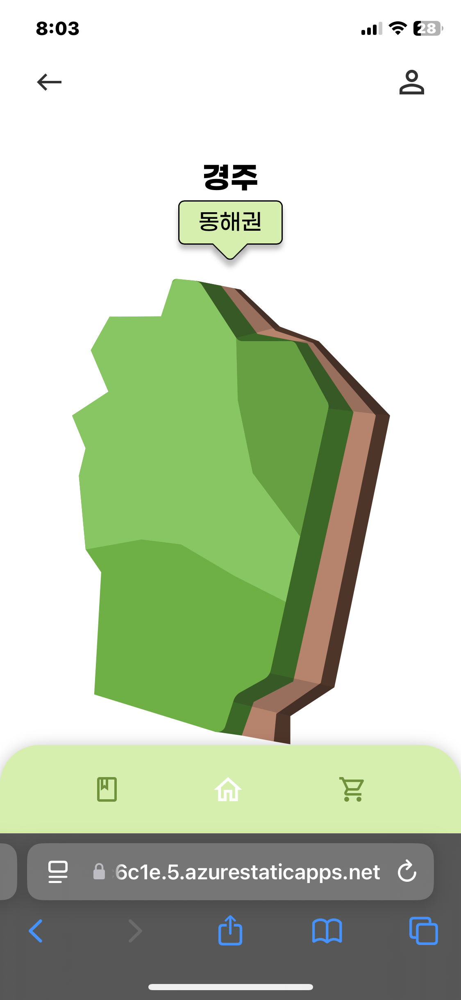
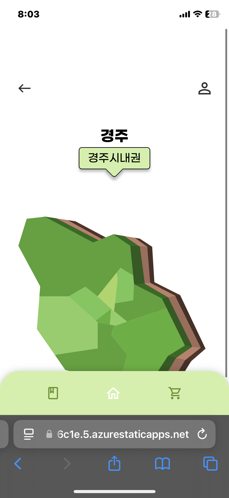
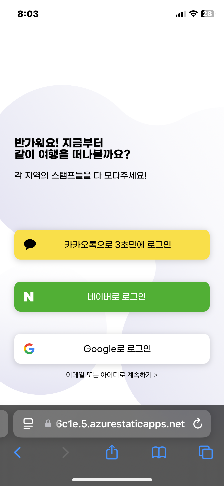

# 모다라(MODALA)

## 팀

|                                       [시영](https://github.com/krsy0411)                                       |                                        [민주](https://github.com/minzzn)                                        |                                       [현민](https://github.com/baekggum)                                       |                                 [용원](https://github.com/ChoiYongWon)                                 |
| :-------------------------------------------------------------------------------------------------------------: | :-------------------------------------------------------------------------------------------------------------: | :-------------------------------------------------------------------------------------------------------------: | :----------------------------------------------------------------------------------------------------: |
|                    |                    |                   |           |
|  |  |  |  |

## 화면

### 메인

#### 권역

### 로그인

#### API swagger 주소

